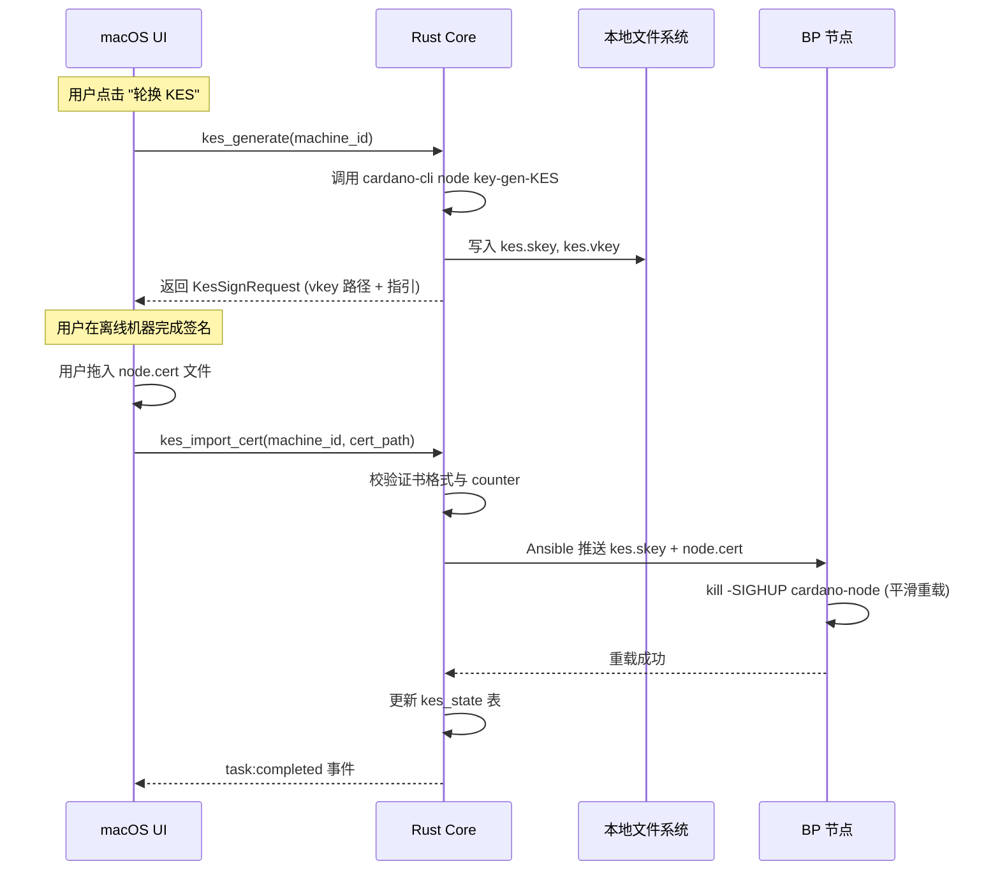

# Cardano Stake Pool 控制平面 - 详细设计文档 (Detail Design)

**项目代号：** Cardano-SPO-Pilot (M0)
**文档版本：** v1.0
**创建日期：** 2026-03-02
**上游文档：** PRD v1.1 / HLD v1.0

---

## 一、 技术选型与版本基线

| 组件 | 技术 | 版本基线 | 说明 |
| :--- | :--- | :--- | :--- |
| 桌面框架 | Tauri | 2.x | Rust 内核，WebView 渲染 |
| 前端 | React + TypeScript | React 19 / TS 5.x | SPA，Vite 构建 |
| UI 库 | Tailwind CSS + shadcn/ui | Tailwind 4.x | 原子化样式 + 无头组件 |
| 状态管理 | Zustand | 5.x | 轻量级，天然支持 Tauri IPC |
| 后端运行时 | Rust (Tauri Core) | Rust 1.80+ | 文件 I/O、进程管理、Keychain |
| 自动化引擎 | Ansible (via ansible-runner) | Ansible 2.17+ / Runner 2.4+ | Sidecar 进程内嵌 |
| 本地数据库 | SQLite | 3.45+ | 通过 rusqlite crate 访问 |
| 包管理 (Python) | uv | 最新稳定版 | Sidecar 内 Python 依赖管理 |

---

## 二、 项目目录结构

```
ouro-ops/
├── src-tauri/                    # Tauri Rust 后端
│   ├── src/
│   │   ├── main.rs               # 入口
│   │   ├── lib.rs                # Tauri 插件注册
│   │   ├── commands/             # IPC Command 模块
│   │   │   ├── mod.rs
│   │   │   ├── machine.rs        # 主机管理命令
│   │   │   ├── deploy.rs         # 部署引擎命令
│   │   │   ├── upgrade.rs        # 升级引擎命令
│   │   │   ├── kes.rs            # KES 管理命令
│   │   │   └── monitor.rs        # 监控命令
│   │   ├── db/                   # 数据库层
│   │   │   ├── mod.rs
│   │   │   ├── schema.rs         # 表结构与迁移
│   │   │   └── repo.rs           # 数据访问对象
│   │   ├── sidecar/              # Sidecar 进程管理
│   │   │   ├── mod.rs
│   │   │   └── runner.rs         # ansible-runner 封装
│   │   ├── keychain.rs           # macOS Keychain 交互
│   │   └── error.rs              # 统一错误类型
│   ├── migrations/               # SQLite 迁移脚本
│   ├── Cargo.toml
│   └── tauri.conf.json
├── src/                          # React 前端
│   ├── App.tsx
│   ├── main.tsx
│   ├── components/               # 通用 UI 组件
│   │   ├── Layout.tsx
│   │   ├── Sidebar.tsx
│   │   ├── ConfirmModal.tsx      # 二次确认弹窗
│   │   └── TaskLogStream.tsx     # 实时日志流组件
│   ├── pages/                    # 页面级组件
│   │   ├── Dashboard.tsx
│   │   ├── MachineManager.tsx
│   │   ├── DeployWizard.tsx
│   │   ├── UpgradeWizard.tsx
│   │   ├── KesManager.tsx
│   │   └── Settings.tsx
│   ├── stores/                   # Zustand 状态
│   │   ├── machineStore.ts
│   │   ├── taskStore.ts
│   │   └── monitorStore.ts
│   ├── hooks/                    # 自定义 Hooks
│   │   ├── useTauriEvent.ts      # Tauri 事件监听
│   │   └── useTaskStream.ts      # 任务日志流
│   └── lib/
│       ├── ipc.ts                # Tauri invoke 封装
│       └── types.ts              # 共享类型定义
├── ansible/                      # Ansible Playbooks
│   ├── inventory/                # 动态 inventory 插件
│   │   └── sqlite_inventory.py
│   ├── roles/
│   │   ├── common/               # 基础环境（Chrony, Swap, ulimit）
│   │   ├── hardening/            # 安全加固（UFW, Fail2ban, SSH）
│   │   ├── cardano-node/         # 节点部署（Docker）
│   │   ├── cardano-upgrade/      # 节点升级
│   │   └── kes-rotate/           # KES 轮换推送
│   ├── playbooks/
│   │   ├── deploy.yml            # 全量部署
│   │   ├── upgrade.yml           # 滚动升级
│   │   ├── kes-push.yml          # KES 证书推送
│   │   ├── health-check.yml      # 健康检查
│   │   └── rollback.yml          # 回滚
│   └── group_vars/
│       ├── relay.yml
│       └── bp.yml
├── sidecar/                      # Python Sidecar 环境
│   ├── pyproject.toml            # uv 项目定义
│   └── src/
│       └── runner_bridge.py      # ansible-runner 桥接脚本
├── docs/
├── package.json
└── vite.config.ts
```

---

## 三、 Tauri IPC 接口定义 (Commands)

所有前端与 Rust 内核的通信通过 `tauri::command` 实现。以下按模块列出核心接口。

> **Pool 策略约定：** MVP 阶段采用"隐式单池"模式。应用首次启动时通过 Settings 页的初始化向导创建唯一 Pool 记录，后续所有 Machine 自动关联该 Pool。数据模型保留 `pool` 表与 `machine.pool_id` 外键，为未来多池管理预留扩展能力，但 MVP 阶段 UI 不暴露多池切换入口。

### 3.0 矿池配置 (pool)

```rust
/// 初始化矿池（首次启动向导调用，仅允许创建一次）
#[tauri::command]
async fn pool_init(payload: PoolInitPayload) -> Result<Pool, AppError>;

/// 获取当前矿池配置
#[tauri::command]
async fn pool_get() -> Result<Pool, AppError>;

/// 更新矿池配置（Ticker、Margin、Cost 等）
#[tauri::command]
async fn pool_update(payload: PoolUpdatePayload) -> Result<Pool, AppError>;
```

```typescript
interface PoolInitPayload {
  ticker: string;                // 3-5 字符
  network: 'mainnet' | 'preprod' | 'preview';
  margin?: number;               // 0.0 - 1.0
  fixed_cost?: number;           // lovelace，默认 340_000_000
}

interface PoolUpdatePayload {
  ticker?: string;
  margin?: number;
  fixed_cost?: number;
}

interface Pool {
  id: number;
  ticker: string;
  network: string;
  margin: number | null;
  fixed_cost: number | null;
  kes_expiry_date: string | null;
  created_at: string;
  updated_at: string;
}
```

**前端流程：**
- 应用启动时调用 `pool_get()`，若返回空则跳转初始化向导
- 初始化向导：输入 Ticker + 选择 Network → 调用 `pool_init()` → 跳转 Dashboard
- Settings 页提供 `pool_update()` 入口修改 Margin/Cost

### 3.1 主机管理 (machine)

```rust
/// 添加主机，自动校验 SSH 连通性
#[tauri::command]
async fn machine_add(payload: MachineAddPayload) -> Result<Machine, AppError>;

/// 删除主机
#[tauri::command]
async fn machine_remove(machine_id: i64) -> Result<(), AppError>;

/// 列出所有主机
#[tauri::command]
async fn machine_list(filter: Option<MachineFilter>) -> Result<Vec<Machine>, AppError>;

/// 测试 SSH 连通性 + 环境预检（OS、磁盘、内存）
#[tauri::command]
async fn machine_preflight(machine_id: i64) -> Result<PreflightReport, AppError>;

/// 检查 ssh-agent 中已加载的密钥指纹列表
#[tauri::command]
async fn ssh_agent_list_keys() -> Result<Vec<SshKeyInfo>, AppError>;
```

**核心类型：**

```typescript
// 前端 TypeScript 类型（与 Rust 结构体一一对应）
interface MachineAddPayload {
  name: string;
  ip: string;
  port: number;          // 默认 22
  ssh_user: string;       // 默认 root
  role: 'relay' | 'bp' | 'archive';
  network: 'mainnet' | 'preprod' | 'preview';
  ssh_key_fingerprint: string;  // 从 ssh-agent 选择
}

interface PreflightReport {
  ssh_ok: boolean;
  os_version: string;
  disk_available_gb: number;
  memory_total_gb: number;
  disk_iops: number;
  warnings: string[];     // 如 "磁盘空间不足 300GB"
}
```

### 3.2 部署引擎 (deploy)

```rust
/// 启动部署任务（向导完成后调用）
#[tauri::command]
async fn deploy_start(payload: DeployPayload, app: AppHandle) -> Result<TaskId, AppError>;

/// 查询部署任务状态
#[tauri::command]
async fn deploy_status(task_id: String) -> Result<TaskStatus, AppError>;

/// 取消正在执行的部署
#[tauri::command]
async fn deploy_cancel(task_id: String) -> Result<(), AppError>;
```

```typescript
interface DeployPayload {
  machine_ids: number[];
  cardano_version: string;       // Docker 镜像 tag
  network: 'mainnet' | 'preprod' | 'preview';
  enable_swap: boolean;
  swap_size_gb: number;          // 8-16
  enable_chrony: boolean;
  enable_hardening: boolean;     // UFW + Fail2ban + SSH 加固
}
```

### 3.3 升级引擎 (upgrade)

```rust
/// 启动滚动升级
#[tauri::command]
async fn upgrade_start(payload: UpgradePayload, app: AppHandle) -> Result<TaskId, AppError>;

/// 用户确认继续升级下一台 / 升级 BP
#[tauri::command]
async fn upgrade_confirm_next(task_id: String) -> Result<(), AppError>;

/// 触发回滚
#[tauri::command]
async fn upgrade_rollback(task_id: String, machine_id: i64) -> Result<TaskId, AppError>;
```

```typescript
interface UpgradePayload {
  target_version: string;        // 目标镜像 tag
  machine_ids: number[];         // 按顺序：Relay... -> BP
  auto_continue: boolean;        // true = Relay 间自动继续，BP 仍需手动确认
}
```

### 3.4 KES 管理 (kes)

```rust
/// 获取所有 BP 节点的 KES 状态
#[tauri::command]
async fn kes_status_all() -> Result<Vec<KesStatus>, AppError>;

/// 生成新 KES 密钥对，返回待签名文件路径
#[tauri::command]
async fn kes_generate(machine_id: i64) -> Result<KesSignRequest, AppError>;

/// 导入用户离线签名后的证书，推送至 BP
#[tauri::command]
async fn kes_import_cert(machine_id: i64, cert_path: String, app: AppHandle) -> Result<TaskId, AppError>;
```

```typescript
interface KesStatus {
  machine_id: number;
  machine_name: string;
  kes_period_current: number;
  kes_period_max: number;
  remaining_days: number;
  severity: 'healthy' | 'warning' | 'critical';  // >10d / 3-10d / <3d
}

interface KesSignRequest {
  kes_vkey_path: string;         // 导出的 kes.vkey 文件路径
  counter_value: number;         // 当前 counter
  instructions: string;          // 离线签名操作指引文本
}
```

### 3.5 监控 (monitor)

```rust
/// 获取所有节点实时指标快照
#[tauri::command]
async fn monitor_snapshot() -> Result<Vec<NodeMetrics>, AppError>;

/// 启动后台轮询（通过 Tauri Event 推送更新）
#[tauri::command]
async fn monitor_start_polling(interval_secs: u64) -> Result<(), AppError>;

/// 停止后台轮询
#[tauri::command]
async fn monitor_stop_polling() -> Result<(), AppError>;
```

```typescript
interface NodeMetrics {
  machine_id: number;
  machine_name: string;
  role: string;
  block_height: number;
  sync_progress: number;         // 0.0 - 100.0
  peers_count: number;
  mempool_size: number;
  cpu_percent: number;
  memory_percent: number;
  disk_used_percent: number;
  missed_slots_24h: number;      // 仅 BP
  status: 'healthy' | 'warning' | 'critical';
  updated_at: string;            // ISO 8601
}
```

---

## 四、 Tauri 事件通道设计 (Event System)

长时间运行的任务（部署、升级、KES 推送）通过 Tauri Event 向前端推送实时进度，避免轮询。

| 事件名 | Payload 类型 | 触发时机 |
| :--- | :--- | :--- |
| `task:progress` | `TaskProgressEvent` | Ansible Runner 每完成一个 Task |
| `task:log` | `TaskLogEvent` | Ansible 标准输出/错误输出的每一行 |
| `task:completed` | `TaskCompletedEvent` | 任务正常结束 |
| `task:failed` | `TaskFailedEvent` | 任务异常终止 |
| `upgrade:gate` | `UpgradeGateEvent` | 滚动升级等待用户确认 |
| `monitor:update` | `Vec<NodeMetrics>` | 监控轮询周期到达 |
| `kes:alert` | `KesAlertEvent` | KES 剩余天数低于阈值 |

```typescript
interface TaskProgressEvent {
  task_id: string;
  machine_name: string;
  ansible_task_name: string;
  status: 'ok' | 'changed' | 'failed' | 'skipped';
  progress_percent: number;      // 已完成 task 数 / 总 task 数
}

interface TaskLogEvent {
  task_id: string;
  stream: 'stdout' | 'stderr';
  line: string;
  timestamp: string;
}

interface UpgradeGateEvent {
  task_id: string;
  completed_machine: string;
  next_machine: string;
  is_bp: boolean;                // BP 升级需要额外确认
  message: string;
}
```

---

## 五、 Sidecar 进程管理

### 5.1 架构

Sidecar 是一个独立的 Python 进程，内嵌 `ansible-runner` 库。Tauri Rust 内核通过 **stdin/stdout JSON-RPC** 协议与其通信。

```
┌──────────────┐   JSON-RPC (stdio)   ┌──────────────────┐
│  Tauri Rust  │ ◄──────────────────► │  Python Sidecar  │
│  (父进程)     │                      │  runner_bridge.py │
└──────────────┘                      └────────┬─────────┘
                                               │
                                      ansible-runner API
                                               │
                                      ┌────────▼─────────┐
                                      │  Ansible Engine   │
                                      │  (Playbooks)      │
                                      └──────────────────┘
```

### 5.2 Sidecar 生命周期

| 阶段 | 行为 |
| :--- | :--- |
| **App 启动** | Rust 通过 `tauri::api::process::Command` 启动 Sidecar 子进程 |
| **健康检查** | 发送 `{"method": "ping"}` 确认 Sidecar 就绪 |
| **任务执行** | 发送 `{"method": "run_playbook", "params": {...}}` |
| **事件回传** | Sidecar 通过 stdout 逐行输出 `{"event": "task_progress", ...}` |
| **App 退出** | 发送 `{"method": "shutdown"}`，等待 5s 后强制 kill |

### 5.3 JSON-RPC 协议

**请求格式：**
```json
{
  "id": "uuid-v4",
  "method": "run_playbook",
  "params": {
    "playbook": "deploy.yml",
    "inventory": {"relay-1": {"ansible_host": "1.2.3.4", "ansible_user": "root"}},
    "extra_vars": {"cardano_version": "10.2.1", "swap_size": "8G"},
    "tags": ["chrony", "swap", "docker", "cardano"]
  }
}
```

**事件流输出（每行一个 JSON）：**
```json
{"id": "uuid", "event": "runner_on_ok", "data": {"host": "relay-1", "task": "Install Chrony", "result": "changed"}}
{"id": "uuid", "event": "runner_on_failed", "data": {"host": "relay-1", "task": "Start container", "msg": "..."}}
{"id": "uuid", "event": "playbook_complete", "data": {"status": "successful", "rc": 0}}
```

---

## 六、 数据模型详细设计 (SQLite)

> **MVP 单池约定：** `pool` 表在 MVP 阶段最多存在一条记录，由首次启动向导通过 `pool_init()` 创建。`machine.pool_id` 外键在添加主机时自动填充为该唯一 Pool 的 ID，前端无需用户手动选择。此设计使未来扩展多池时仅需在 UI 层增加 Pool 选择器，数据层无需迁移。

### 6.1 ER 关系

```
Pool 1──N Machine
Pool 1──N TaskHistory
Machine 1──N TaskHistory (通过 task_machines 关联)
Machine 1──1 MachineHealth (最新快照)
```

### 6.2 完整表结构

```sql
-- ==================== 矿池配置 ====================
CREATE TABLE pool (
    id          INTEGER PRIMARY KEY AUTOINCREMENT,
    ticker      TEXT NOT NULL UNIQUE,
    network     TEXT NOT NULL CHECK(network IN ('mainnet', 'preprod', 'preview')),
    margin      REAL,
    fixed_cost  INTEGER,                -- lovelace
    created_at  TEXT DEFAULT (datetime('now')),
    updated_at  TEXT DEFAULT (datetime('now'))
);

-- ==================== 主机信息 ====================
CREATE TABLE machine (
    id                  INTEGER PRIMARY KEY AUTOINCREMENT,
    pool_id             INTEGER NOT NULL REFERENCES pool(id) ON DELETE CASCADE,
    name                TEXT NOT NULL,
    ip                  TEXT NOT NULL,
    ssh_port            INTEGER DEFAULT 22,
    ssh_user            TEXT DEFAULT 'root',
    role                TEXT NOT NULL CHECK(role IN ('relay', 'bp', 'archive')),
    ssh_key_fingerprint TEXT,           -- 对应 ssh-agent 中的指纹
    os_version          TEXT,
    cardano_version     TEXT,           -- 当前运行版本
    sort_order          INTEGER DEFAULT 0,  -- 升级顺序
    created_at          TEXT DEFAULT (datetime('now')),
    updated_at          TEXT DEFAULT (datetime('now')),
    UNIQUE(pool_id, ip)
);

-- ==================== KES 状态 ====================
CREATE TABLE kes_state (
    id                  INTEGER PRIMARY KEY AUTOINCREMENT,
    machine_id          INTEGER NOT NULL REFERENCES machine(id) ON DELETE CASCADE,
    kes_period_current  INTEGER,
    kes_period_max      INTEGER,
    op_cert_counter     INTEGER,
    expiry_date         TEXT,           -- 预计过期日期
    last_checked_at     TEXT DEFAULT (datetime('now')),
    UNIQUE(machine_id)                  -- 每台 BP 仅一条记录
);

-- ==================== 任务记录 ====================
CREATE TABLE task (
    id          TEXT PRIMARY KEY,        -- UUID
    task_type   TEXT NOT NULL CHECK(task_type IN (
                    'deploy', 'upgrade', 'kes_rotation',
                    'rollback', 'health_check', 'hardening'
                )),
    status      TEXT NOT NULL DEFAULT 'pending' CHECK(status IN (
                    'pending', 'running', 'paused',
                    'success', 'failed', 'cancelled'
                )),
    payload     TEXT,                    -- JSON，存储任务参数快照
    error_msg   TEXT,
    started_at  TEXT,
    finished_at TEXT,
    created_at  TEXT DEFAULT (datetime('now'))
);

-- ==================== 任务-主机关联 ====================
CREATE TABLE task_machine (
    task_id     TEXT NOT NULL REFERENCES task(id) ON DELETE CASCADE,
    machine_id  INTEGER NOT NULL REFERENCES machine(id) ON DELETE CASCADE,
    status      TEXT DEFAULT 'pending',  -- 单机维度状态
    log_path    TEXT,                     -- 该机器的日志文件路径
    PRIMARY KEY (task_id, machine_id)
);

-- ==================== 主机健康快照 ====================
CREATE TABLE machine_health (
    id                  INTEGER PRIMARY KEY AUTOINCREMENT,
    machine_id          INTEGER NOT NULL REFERENCES machine(id) ON DELETE CASCADE,
    block_height        INTEGER,
    sync_progress       REAL,            -- 0.0 - 100.0
    peers_count         INTEGER,
    mempool_size        INTEGER,
    cpu_percent         REAL,
    memory_percent      REAL,
    disk_used_percent   REAL,
    missed_slots_24h    INTEGER DEFAULT 0,
    collected_at        TEXT DEFAULT (datetime('now'))
);

-- 仅保留最近 24h 的健康数据，定期清理
CREATE INDEX idx_health_time ON machine_health(machine_id, collected_at);

-- ==================== 审计日志 ====================
CREATE TABLE audit_log (
    id          INTEGER PRIMARY KEY AUTOINCREMENT,
    action      TEXT NOT NULL,           -- 'machine_add', 'deploy_start', 'kes_rotate' 等
    detail      TEXT,                    -- JSON 详情
    created_at  TEXT DEFAULT (datetime('now'))
);
```

### 6.3 迁移策略

使用 `rusqlite` 内置的 `user_version` pragma 管理版本：

```rust
const MIGRATIONS: &[&str] = &[
    include_str!("../migrations/001_init.sql"),
    // 后续版本追加
];

fn run_migrations(conn: &Connection) -> Result<()> {
    let current: i32 = conn.pragma_query_value(None, "user_version", |r| r.get(0))?;
    for (i, sql) in MIGRATIONS.iter().enumerate() {
        if i as i32 >= current {
            conn.execute_batch(sql)?;
            conn.pragma_update(None, "user_version", i as i32 + 1)?;
        }
    }
    Ok(())
}
```

---

## 七、 核心业务流程状态机

### 7.1 部署流程状态机

```
                    ┌─────────┐
                    │  IDLE   │
                    └────┬────┘
                         │ deploy_start()
                    ┌────▼────┐
                    │PREFLIGHT│ ── 预检失败 ──► FAILED
                    └────┬────┘
                         │ 预检通过
                    ┌────▼────┐
                    │DEPLOYING│ ── 用户取消 ──► CANCELLED
                    │(逐台执行)│ ── 任务失败 ──► FAILED
                    └────┬────┘
                         │ 全部完成
                    ┌────▼────┐
                    │VERIFYING│ ── 同步未达标 ──► WARNING
                    │(同步检测)│
                    └────┬────┘
                         │ SyncProgress == 100%
                    ┌────▼────┐
                    │ SUCCESS │
                    └─────────┘
```

### 7.2 滚动升级状态机

```
                    ┌─────────┐
                    │  IDLE   │
                    └────┬────┘
                         │ upgrade_start()
                    ┌────▼────────┐
                    │BACKUP_CONFIG│ ── 备份失败 ──► FAILED
                    └────┬────────┘
                         │
              ┌──────────▼──────────┐
              │  UPGRADING_RELAY_N  │◄──────────────┐
              │  (停容器→拉镜像→启动) │                │
              └──────────┬──────────┘                │
                         │                           │
              ┌──────────▼──────────┐                │
              │  HEALTH_GATE_RELAY  │── 超时 ──► FAILED (可回滚)
              │  (等待 Sync 100%)   │                │
              └──────────┬──────────┘                │
                         │ 通过                       │
              ┌──────────▼──────────┐   还有 Relay    │
              │  AWAIT_NEXT_RELAY   │────────────────┘
              │  (auto/手动确认)     │
              └──────────┬──────────┘
                         │ 所有 Relay 完成
              ┌──────────▼──────────┐
              │  AWAIT_BP_CONFIRM   │ ── 用户取消 ──► PARTIAL_SUCCESS
              │  (必须手动确认)      │
              └──────────┬──────────┘
                         │ 用户确认
              ┌──────────▼──────────┐
              │   UPGRADING_BP      │ ── 失败 ──► FAILED (可回滚)
              └──────────┬──────────┘
                         │
              ┌──────────▼──────────┐
              │  HEALTH_GATE_BP     │
              └──────────┬──────────┘
                         │
              ┌──────────▼──────────┐
              │      SUCCESS        │
              └─────────────────────┘
```

### 7.3 KES 轮换流程



---

## 八、 Ansible Playbook 详细设计

### 8.1 Role: common（基础环境）

```yaml
# roles/common/tasks/main.yml
---
- name: 配置时间同步 (Chrony)
  when: enable_chrony | default(true)
  block:
    - name: 安装 Chrony
      apt:
        name: chrony
        state: present
        update_cache: yes

    - name: 启动并设为开机自启
      systemd:
        name: chrony
        state: started
        enabled: yes

- name: 配置 Swap
  when: enable_swap | default(true)
  block:
    - name: 检查现有 Swap
      command: swapon --show
      register: swap_check
      changed_when: false

    - name: 创建 Swap 文件
      command: "fallocate -l {{ swap_size | default('8G') }} /swapfile"
      when: swap_check.stdout == ""

    - name: 设置权限并启用
      shell: |
        chmod 600 /swapfile
        mkswap /swapfile
        swapon /swapfile
        echo '/swapfile none swap sw 0 0' >> /etc/fstab
      when: swap_check.stdout == ""

- name: 配置 ulimit
  pam_limits:
    domain: '*'
    limit_type: '-'
    limit_item: nofile
    value: '65536'

- name: 配置 Docker 日志轮转
  copy:
    dest: /etc/docker/daemon.json
    content: |
      {
        "log-driver": "json-file",
        "log-opts": {
          "max-size": "10m",
          "max-file": "3"
        }
      }
  notify: restart docker
```

### 8.2 Role: hardening（安全加固）

```yaml
# roles/hardening/tasks/main.yml
---
- name: 禁用密码登录
  lineinfile:
    path: /etc/ssh/sshd_config
    regexp: '^#?PasswordAuthentication'
    line: 'PasswordAuthentication no'
  notify: restart sshd

- name: 安装 Fail2ban
  apt:
    name: fail2ban
    state: present

- name: 配置 Fail2ban SSH 规则
  copy:
    dest: /etc/fail2ban/jail.local
    content: |
      [sshd]
      enabled = true
      port = {{ ssh_port | default(22) }}
      maxretry = 5
      bantime = 3600
  notify: restart fail2ban

- name: 配置 UFW 防火墙
  block:
    - name: 默认拒绝入站
      ufw:
        direction: incoming
        policy: deny

    - name: 允许 SSH
      ufw:
        rule: allow
        port: "{{ ssh_port | default(22) }}"
        proto: tcp

    - name: 允许 Cardano 节点端口 (Relay)
      ufw:
        rule: allow
        port: "3001"
        proto: tcp
      when: role == 'relay'

    - name: 允许 BP 仅接受 Relay 流量
      ufw:
        rule: allow
        port: "3001"
        proto: tcp
        from_ip: "{{ item }}"
      loop: "{{ trusted_relay_ips }}"
      when: role == 'bp'

    - name: 启用 UFW
      ufw:
        state: enabled
```

### 8.3 Role: cardano-node（节点部署）

```yaml
# roles/cardano-node/tasks/main.yml
---
- name: 预检 - 磁盘空间
  shell: df -BG / | awk 'NR==2 {print $4}' | tr -d 'G'
  register: disk_free
  changed_when: false
  failed_when: disk_free.stdout | int < 50

- name: 创建数据目录
  file:
    path: "{{ item }}"
    state: directory
    mode: '0755'
  loop:
    - /opt/cardano/config
    - /opt/cardano/db
    - /opt/cardano/keys

- name: 生成 topology.json
  template:
    src: topology.json.j2
    dest: /opt/cardano/config/topology.json

- name: 拉取 Cardano 节点镜像
  community.docker.docker_image:
    name: "ghcr.io/intersectmbo/cardano-node"
    tag: "{{ cardano_version }}"
    source: pull

- name: 启动 Cardano 节点容器
  community.docker.docker_container:
    name: cardano-node
    image: "ghcr.io/intersectmbo/cardano-node:{{ cardano_version }}"
    state: started
    restart_policy: unless-stopped
    ports:
      - "3001:3001"
    volumes:
      - /opt/cardano/config:/config
      - /opt/cardano/db:/db
      - /opt/cardano/keys:/keys
    command: >
      run
      --topology /config/topology.json
      --database-path /db
      --socket-path /db/node.socket
      --config /config/{{ network }}-config.json
      --port 3001

- name: 等待节点启动
  wait_for:
    port: 3001
    timeout: 60

- name: 检查同步进度
  shell: |
    docker exec cardano-node cardano-cli query tip \
      --socket-path /db/node.socket \
      --{{ network }} | jq -r '.syncProgress'
  register: sync_progress
  until: sync_progress.stdout == "100.00"
  retries: 720
  delay: 30
  changed_when: false
```

### 8.4 Playbook: upgrade.yml（滚动升级）

```yaml
# playbooks/upgrade.yml
---
- name: 备份配置
  hosts: all
  tasks:
    - name: 备份 /opt/cardano/config
      archive:
        path: /opt/cardano/config
        dest: "/opt/cardano/backup/config-{{ ansible_date_time.iso8601_basic }}.tar.gz"

- name: 滚动升级 Relay 节点
  hosts: relay
  serial: 1
  order: sorted
  tasks:
    - name: 停止旧容器
      community.docker.docker_container:
        name: cardano-node
        state: stopped

    - name: 更新镜像并启动
      community.docker.docker_container:
        name: cardano-node
        image: "ghcr.io/intersectmbo/cardano-node:{{ target_version }}"
        state: started
        restart_policy: unless-stopped

    - name: 健康门禁 - 等待同步恢复
      shell: |
        docker exec cardano-node cardano-cli query tip \
          --socket-path /db/node.socket \
          --{{ network }} | jq -r '.syncProgress'
      register: sync
      until: sync.stdout == "100.00"
      retries: 120
      delay: 30
      changed_when: false

- name: 升级 BP 节点（需人工确认后触发）
  hosts: bp
  tasks:
    - name: 停止旧容器
      community.docker.docker_container:
        name: cardano-node
        state: stopped

    - name: 更新镜像并启动
      community.docker.docker_container:
        name: cardano-node
        image: "ghcr.io/intersectmbo/cardano-node:{{ target_version }}"
        state: started
        restart_policy: unless-stopped

    - name: 健康门禁
      shell: |
        docker exec cardano-node cardano-cli query tip \
          --socket-path /db/node.socket \
          --{{ network }} | jq -r '.syncProgress'
      register: sync
      until: sync.stdout == "100.00"
      retries: 120
      delay: 30
      changed_when: false
```

---

## 九、 安全实现细节

### 9.1 macOS Keychain 集成

```rust
// keychain.rs - 核心交互逻辑

/// 从 Keychain 读取 SSH Key 引用（不提取私钥）
/// 应用仅使用 ssh-agent 转发，私钥永远不进入应用内存
pub fn verify_ssh_agent_key(fingerprint: &str) -> Result<bool> {
    let output = Command::new("ssh-add")
        .arg("-l")
        .output()?;
    let keys = String::from_utf8_lossy(&output.stdout);
    Ok(keys.contains(fingerprint))
}

/// 引导用户将 SSH Key 添加到 agent（触发 Keychain 授权弹窗）
pub fn prompt_add_key(key_path: &str) -> Result<()> {
    Command::new("ssh-add")
        .arg("--apple-use-keychain")
        .arg(key_path)
        .status()?;
    Ok(())
}
```

### 9.2 SSH ControlMaster 配置

任务执行期间动态生成 SSH 配置，复用连接减少握手开销：

```
# 临时生成，任务结束后删除
Host *
    ControlMaster auto
    ControlPath /tmp/ouro-ops-%r@%h:%p
    ControlPersist 300
    StrictHostKeyChecking accept-new
    ServerAliveInterval 30
    ServerAliveCountMax 3
```

### 9.3 二次确认矩阵

| 操作 | 确认级别 | UI 行为 |
| :--- | :--- | :--- |
| 添加/删除主机 | 无 | 直接执行 |
| 部署节点 | 标准确认 | Modal: 展示目标机器列表 |
| 升级 Relay | 标准确认 | Modal: 展示版本变更 |
| 升级 BP | 高危确认 | Modal: 红色警告 + 输入 Ticker 确认 |
| KES 证书推送 | 高危确认 | Modal: 展示证书详情 + 输入 Ticker 确认 |
| 回滚 | 标准确认 | Modal: 展示回滚目标版本 |

---

## 十、 错误处理与恢复策略

### 10.1 错误码体系

```rust
#[derive(Debug, thiserror::Error)]
pub enum AppError {
    // 1xxx - 连接类
    #[error("SSH 连接超时: {0}")]
    SshTimeout(String),                    // 1001
    #[error("SSH 认证失败: {0}")]
    SshAuthFailed(String),                 // 1002
    #[error("ssh-agent 中未找到密钥: {0}")]
    SshKeyNotFound(String),                // 1003

    // 2xxx - 预检类
    #[error("磁盘空间不足: 剩余 {0}GB，需要 ≥50GB")]
    DiskInsufficient(u64),                 // 2001
    #[error("内存不足: {0}GB，建议 ≥16GB")]
    MemoryLow(u64),                        // 2002
    #[error("OS 版本不支持: {0}")]
    UnsupportedOS(String),                 // 2003

    // 3xxx - 任务执行类
    #[error("Ansible Playbook 执行失败: {0}")]
    PlaybookFailed(String),                // 3001
    #[error("同步停滞: {0} 分钟内区块高度未增长")]
    SyncStalled(u64),                      // 3002
    #[error("容器启动失败: {0}")]
    ContainerStartFailed(String),          // 3003
    #[error("健康检查超时")]
    HealthCheckTimeout,                    // 3004

    // 4xxx - KES 类
    #[error("KES 证书格式无效")]
    InvalidKesCert,                        // 4001
    #[error("KES counter 不匹配: 期望 {expected}, 实际 {actual}")]
    KesCounterMismatch { expected: u64, actual: u64 }, // 4002

    // 5xxx - 内部错误
    #[error("数据库错误: {0}")]
    Database(#[from] rusqlite::Error),     // 5001
    #[error("Sidecar 进程异常退出")]
    SidecarCrash,                          // 5002
}
```

### 10.2 恢复策略矩阵

| 错误场景 | 自动恢复 | 用户操作 |
| :--- | :--- | :--- |
| SSH 连接超时 | 重试 3 次，间隔 5s | 展示网络诊断建议 |
| 同步停滞 (>10min) | 暂停升级流 | macOS 通知 + 建议检查节点日志 |
| 容器启动后 5min 内崩溃 | 自动检测退出码 | 提供"回滚到旧版本"按钮 |
| 磁盘空间不足 | 拦截任务启动 | 提示清理空间 |
| Sidecar 崩溃 | 自动重启 Sidecar (最多 3 次) | 提示重启应用 |
| KES 证书格式错误 | 无 | 提示重新导出并签名 |

---

## 十一、 前端页面与组件设计

### 11.1 页面路由

| 路由 | 页面 | 说明 |
| :--- | :--- | :--- |
| `/setup` | SetupWizard | 首次启动向导：创建 Pool（Ticker + Network） |
| `/` | Dashboard | 总览：节点状态卡片 + KES 倒计时 + 最近任务 |
| `/machines` | MachineManager | 主机列表、添加/编辑/删除、连通性测试 |
| `/deploy` | DeployWizard | 分步向导：选择机器 → 配置参数 → 确认 → 执行 |
| `/upgrade` | UpgradeWizard | 分步向导：选择版本 → 确认顺序 → 逐台执行 |
| `/kes` | KesManager | KES 状态总览 + 轮换向导 |
| `/settings` | Settings | 矿池配置、通知偏好 |

> 应用启动时检查 `pool_get()` 是否返回数据。若无，强制跳转 `/setup`；完成后重定向至 `/`。

### 11.2 关键组件

**TaskLogStream** - 实时日志流组件：

```typescript
// 监听 Tauri 事件，虚拟滚动渲染日志
function TaskLogStream({ taskId }: { taskId: string }) {
  const [logs, setLogs] = useState<TaskLogEvent[]>([]);

  useEffect(() => {
    const unlisten = listen<TaskLogEvent>('task:log', (event) => {
      if (event.payload.task_id === taskId) {
        setLogs(prev => [...prev, event.payload]);
      }
    });
    return () => { unlisten.then(fn => fn()); };
  }, [taskId]);

  return (
    <div className="font-mono text-sm bg-zinc-900 text-zinc-100 p-4 rounded-lg
                    h-80 overflow-y-auto">
      {logs.map((log, i) => (
        <div key={i} className={log.stream === 'stderr' ? 'text-red-400' : ''}>
          <span className="text-zinc-500">{log.timestamp}</span> {log.line}
        </div>
      ))}
    </div>
  );
}
```

**ConfirmModal** - 二次确认弹窗：

```typescript
interface ConfirmModalProps {
  level: 'standard' | 'dangerous';
  title: string;
  description: string;
  confirmText?: string;          // dangerous 级别需要用户输入此文本
  onConfirm: () => void;
  onCancel: () => void;
}
```

### 11.3 Dashboard 布局

```
┌─────────────────────────────────────────────────────┐
│  Sidebar          │  Dashboard                       │
│  ┌─────────────┐  │  ┌──────────┐ ┌──────────┐      │
│  │ ● Dashboard  │  │  │ Relay-1  │ │ Relay-2  │ ... │
│  │   Machines   │  │  │ ✓ Sync   │ │ ✓ Sync   │      │
│  │   Deploy     │  │  │ H:12345  │ │ H:12345  │      │
│  │   Upgrade    │  │  └──────────┘ └──────────┘      │
│  │   KES        │  │  ┌──────────┐                   │
│  │   Settings   │  │  │ BP-1     │                   │
│  └─────────────┘  │  │ ✓ Sync   │                   │
│                   │  └──────────┘                   │
│                   │                                  │
│                   │  ┌─────────────────────────────┐ │
│                   │  │ KES 剩余: 45 天  ████████░░ │ │
│                   │  └─────────────────────────────┘ │
│                   │                                  │
│                   │  ┌─────────────────────────────┐ │
│                   │  │ 最近任务                      │ │
│                   │  │ ✓ Deploy relay-1  3h ago     │ │
│                   │  │ ✓ Deploy relay-2  2h ago     │ │
│                   │  └─────────────────────────────┘ │
└─────────────────────────────────────────────────────┘
```

---

## 十二、 监控数据采集流程

### 12.1 数据采集链路

```
Remote Node                    Rust Core                  Frontend
┌──────────┐                  ┌──────────┐               ┌────────┐
│ Prometheus│  SSH + curl     │ 解析指标  │  Tauri Event  │ Zustand │
│ /metrics  │ ◄────────────── │ 写入 DB   │ ─────────────►│ Store   │
│ endpoint  │                 │ 判断阈值  │               │ 渲染 UI │
└──────────┘                  └──────────┘               └────────┘
                                   │
                              阈值触发时
                                   │
                              macOS 通知
                         (UserNotifications API)
```

### 12.2 采集指标映射

| Prometheus 指标 | 应用字段 | 采集方式 |
| :--- | :--- | :--- |
| `cardano_node_metrics_blockNum_int` | block_height | SSH curl localhost:12788/metrics |
| `cardano_node_metrics_slotInEpoch_int` | sync_progress | 计算: slot / epoch_length |
| `cardano_node_metrics_connectedPeers_int` | peers_count | 直接映射 |
| `cardano_node_metrics_txsInMempool_int` | mempool_size | 直接映射 |
| `cardano_node_metrics_remainingKESPeriods_int` | kes_remaining | 直接映射 |
| 系统指标 (top/df) | cpu/mem/disk | SSH 执行系统命令 |

### 12.3 告警阈值

| 指标 | Warning (黄) | Critical (红) |
| :--- | :--- | :--- |
| sync_progress | < 99.9% | < 95% |
| peers_count | < 5 | 0 |
| disk_used_percent | > 80% | > 90% |
| kes_remaining_days | < 10 天 | < 3 天 |
| missed_slots_24h | > 0 | > 3 |

---

## 十三、 MVP 阶段开发计划

### Phase 1: 基础框架 (Week 1-2)

- 初始化 Tauri 2.x + React + Vite 项目
- 搭建 Sidecar 进程管理（Python + ansible-runner）
- 实现 SQLite 数据库层 + 迁移机制
- 完成 Tauri Event 通道基础设施

### Phase 2: 主机管理 (Week 3-4)

- 主机 CRUD UI + SSH Agent 密钥列表
- SSH 连通性测试 + 环境预检
- 动态 Inventory 生成

### Phase 3: 部署引擎 (Week 5-7)

- 部署向导 UI（分步表单）
- Ansible Roles: common + hardening + cardano-node
- 实时日志流 + 进度展示
- 同步进度检测

### Phase 4: 监控与 KES (Week 8-10)

- Dashboard 节点状态卡片
- 指标采集 + 告警阈值判断
- KES 剩余天数监控
- KES 离线签名文件导入向导